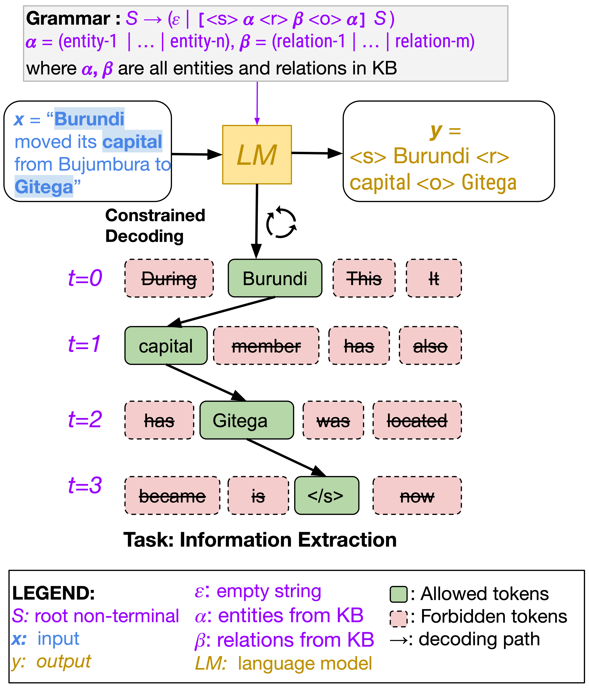

[](https://www.python.org/downloads/release/python-390/)
[](LICENSE)
[](https://arxiv.org/abs/2305.13971)

# Grammar-Constrained Decoding for Structured NLP Tasks without Finetuning

---
## 1. The Overview of GCD

<div align="center">

</div>


## 2. Environment Setup

With the repository cloned, we recommend creating a new [conda](https://docs.conda.io/en/latest/) virtual environment:
```bash
conda create -n GCD python=3.9
conda activate GCD
```

Install the required packages:
```bash
pip install -r requirements.txt
```

## Experiments

- [Download datasets, grammars and models](docs/download_data.md)
- [Build task-specific grammars](https://github.com/Saibo-creator/GF_helper)
- [Windows-specific setting](docs/windows.md)
- [Running the experiments](docs/run_experiments.md)


## Citation

This repository contains the code for the models and experiments in [Grammar-Constrained Decoding for Structured NLP Tasks without Finetuning](https://arxiv.org/abs/2305.13971)

```
@misc{geng2023flexible,
      title={Flexible Grammar-Based Constrained Decoding for Language Models},
      author={Saibo Geng and Martin Josifosky and Maxime Peyrard and Robert West},
      year={2023},
      eprint={2305.13971},
      archivePrefix={arXiv},
      primaryClass={cs.CL}
}
```
**Please consider citing our work, if you found the provided resources useful.**<br>


### License
This project is licensed under the terms of the MIT license.
